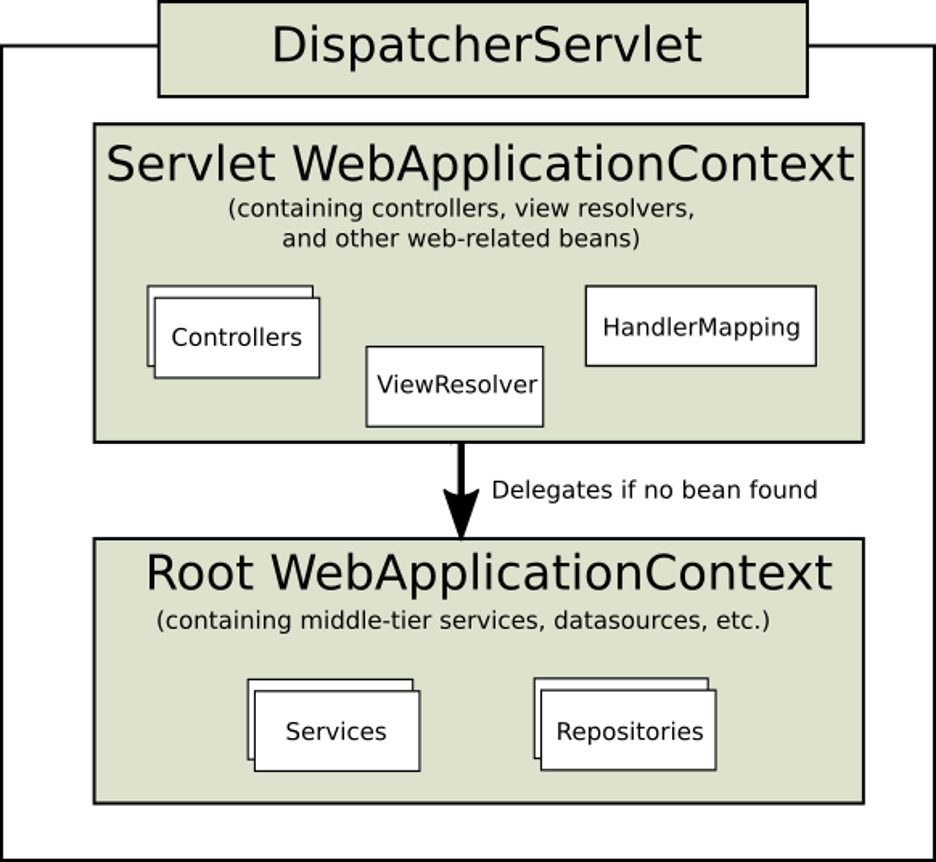

Spring Web MVC is the original web framework built on the Servlet API and has been included in the Spring Framework from the very beginning. The formal name, "Spring Web MVC," comes from the name of its source module (spring-webmvc), but it is more commonly known as "Spring MVC".

Spring MVC, as many other web frameworks, is designed around the front controller pattern where a central Servlet, the DispatcherServlet, provides a shared algorithm for request processing, while actual work is performed by configurable delegate components. This model is flexible and supports diverse workflows.
The DispatcherServlet, as any Servlet, needs to be declared and mapped according to the Servlet specification by using Java configuration or in web.xml. In turn, the DispatcherServlet uses Spring configuration to discover the delegate components it needs for request mapping, view resolution, exception handling, and more.

DispatcherServlet expects a WebApplicationContext (an extension of a plain ApplicationContext) for its own configuration. WebApplicationContext has a link to the ServletContext and the Servlet with which it is associated. It is also bound to the ServletContext such that applications can use static methods on RequestContextUtils to look up the WebApplicationContext if they need access to it.
For many applications, having a single WebApplicationContext is simple and suffices. It is also possible to have a context hierarchy where one root WebApplicationContext is shared across multiple DispatcherServlet (or other Servlet) instances, each with its own child WebApplicationContext configuration. See Additional Capabilities of the ApplicationContext for more on the context hierarchy feature.
The root WebApplicationContext typically contains infrastructure beans, such as data repositories and business services that need to be shared across multiple Servlet instances. Those beans are effectively inherited and can be overridden (that is, re-declared) in the Servlet-specific child WebApplicationContext, which typically contains beans local to the given Servlet. The following image shows this relationship:

# Servlets

Web Container

Inside Web Container there are several Servlets

Servlet – Java object, which handles the http Request and process int

Methods for http specification requests – doGet, doPost … doDelete

# Spring – Dispatcher Servlet

DS allows to register one or more controllers avoiding boilerplate like extract params, validate them and construct objects.

DS routes requests to the appropriate controller. It is the second layer routing after the web container. Request is routed to the specific method instead of common doGet, doPost etc. based not only on path but the params.

